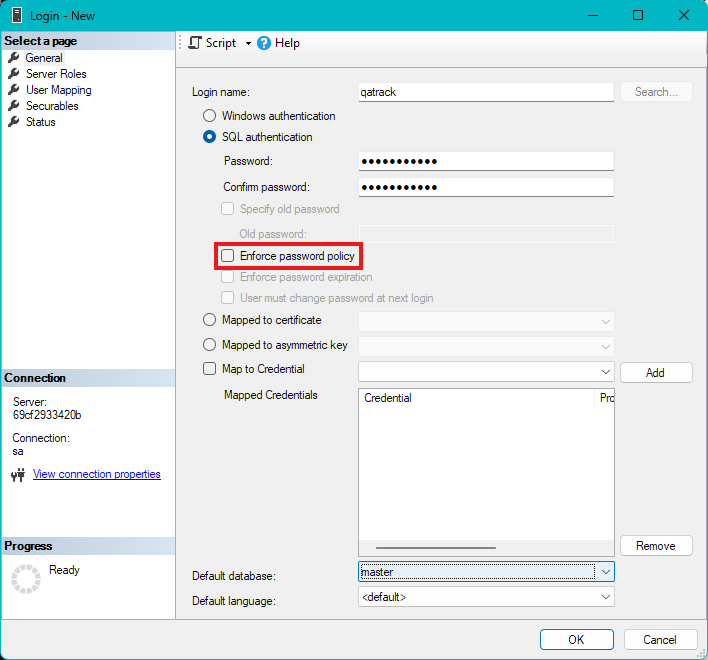
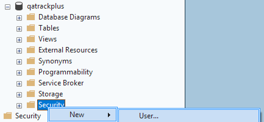
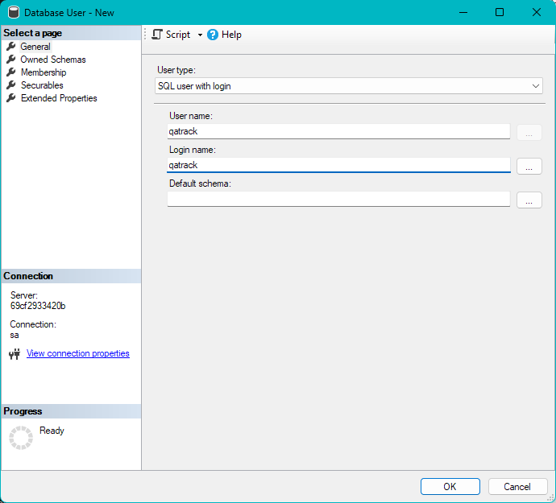
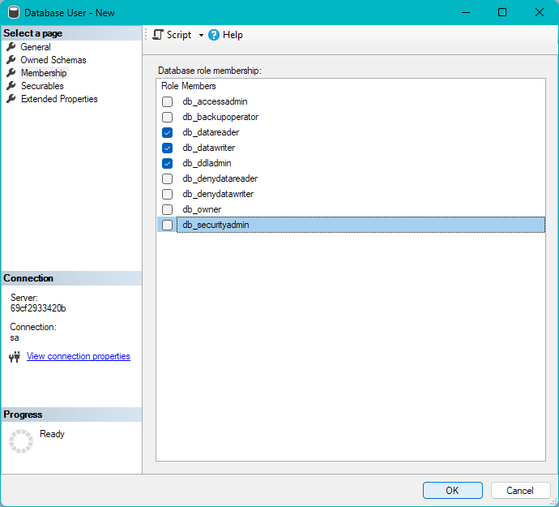
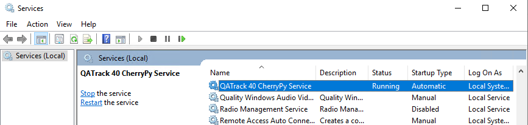
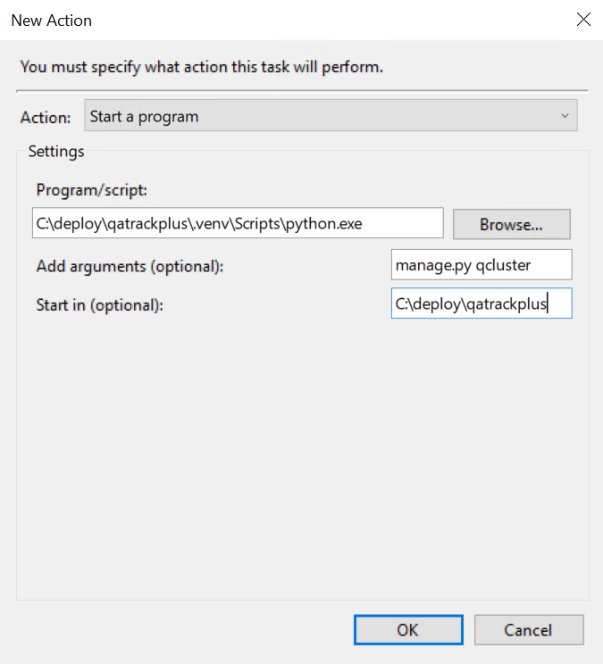

.. _`win_install_40`:

Installing and Deploying QATrack+ on Windows Server
===================================================

.. note::

   This guide assumes you have at least a basic level of familiarity with Windows Server, SQL Server Management Studio, and the command line.

   There are many community members who have successfully installed QATrack+ on Windows Server and can provide guidance and support. You can reach out to the QATrack+ community through the :mailinglist:`QATrack+ Google Group <>` for assistance.

.. contents::
   :local:
   :depth: 2

   
New Installation
----------------

This guide is going to walk you through installing QATrack+ on a Windows Server
2022 server with IIS serving static assets (images, javascript and
stylesheets) and acting as a reverse proxy for a CherryPy web server which
serves our Django application (QATrack+).  The instructions have been tested
with SQL Server 2022 database (and SQL Express).

If you are upgrading an existing QATrack+ installation from version 3.1, please see:

* :ref:`Upgrading an existing v3.x.y installation to v4.0.0
  <win_upgrading_40>`.

.. note::

   This guide assumes you have SQL Server Management Studio (SSMS) and Internet
   Information Services (IIS) installed/enabled

The steps we will be undertaking are:

.. contents::
   :local:
   :depth: 1

Prerequisites
-------------

Managing python dependencies and virtual environments can be a bit tricky on Windows. We have transitioned to using the ``uv`` package manager to handle this for us. To install QATrack+ run the following command in a PowerShell terminal with Administrator privileges:

.. code-block:: powershell

   >>  powershell -ExecutionPolicy ByPass -c "irm https://astral.sh/uv/install.ps1 | iex"
   >>  uv --version # this should print the version of uv installed, e.g. 0.11.20

Before beginning the installation, ensure the following software is installed on your server:

* **Google Chrome**: `Required to generate or schedule PDF reports. <https://www.google.com/chrome/index.html>`_
* **Microsoft Visual C++ Redistributable**: `The ODBC Driver for SQL Server requires this. <https://learn.microsoft.com/en-us/cpp/windows/latest-supported-vc-redist?view=msvc-170#latest-supported-redistributable-version>`_
* **ODBC Driver 17 for SQL Server**: `Required for QATrack+ to communicate with the database. <https://learn.microsoft.com/en-us/sql/connect/odbc/download-odbc-driver-for-sql-server?view=sql-server-ver17>`_
* **SQL Server Management Studio (SSMS)**: `Required for setting up the database. <https://learn.microsoft.com/en-us/ssms/install/install>`_
* **Git for Windows**: `Required to check out the QATrack+ source code. <https://git-scm.com/install/windows>`_
* **IIS** requires the `URL Rewrite 2.1 <https://www.iis.net/downloads/microsoft/url-rewrite>`__ and `Application Request Routing 3.0 <https://www.iis.net/downloads/microsoft/application-request-routing>`__ modules.

For convenience, these installers may be kept in a folder on the server (e.g. C:\\deploy\\installers) for future reference and re-use.

* **SQL Server Express**: May be used if you do not have access to a full SQL Server instance `SQL Server may be installed locally. <https://www.microsoft.com/en-us/sql-server/sql-server-downloads>`_ This option should only be used if local IT resources will not support using a full SQL Server instance. QATrack+ should fit within the licensing limits of SQL Server Express, but it is up to each site to confirm their Microsoft licensing requirements.

.. _`install_application_win`:

Setting up the QATrack+ Application
-------------------------------------

Open a Windows PowerShell terminal and then create a directory for QATrack+ and
check out the source code, use the following commands:

.. code-block:: console

   >>  mkdir C:\deploy
   >>  cd C:\deploy
   >>  git clone https://github.com/qatrackplus/qatrackplus.git

We're now ready to install all the libraries QATrack+ depends on.

.. code-block:: console

   >>  cd qatrackplus
   >>  git fetch origin
   >>  git checkout releases/4.0
   >>  uv venv --python 3.12
   >>  uv sync --extra win --extra mssql

Next, activate your new virtual environment:

.. code-block:: powershell

   >>  .\.venv\Scripts\Activate.ps1

Your command prompt should now be prefixed with ``(qatrackplus)`` or ``(.venv)``.

..    If you are going to be using :ref:`Active Directory <active_directory>` for
   authenticating your users, you need to install pyldap.  There are binaries
   available on this page:
   https://github.com/cgohlke/python-ldap-build.  Download the
   relevant wheel for your distribution (e.g.
   python_ldap-3.4.5-cp312-cp312-win_amd64.whl) and install it directly into your venv:

   .. code-block:: console

      uv pip install C:\path\to\python_ldap-3.4.5-cp312-cp312-win_amd64.whl

Creating a database with SQL Server
-----------------------------------

If you, or your IT department has familiarity with SQL Server, here is a quick summary of the configuration needed.

- a SQL Server instance (either local or remote) with SQL Server Authentication enabled.
- a database named `qatrack`.
- a database user named `qatrack` with `db_ddladmin`, `db_datawriter`, `db_datareader` and `db_owner` permissions on the `qatrack` database.
- a database user named `qatrack_reports` with `db_datareader` permissions on the `qatrack` database.

For most of us, the easiest way to set this up is to use SQL Server Management Studio (SSMS) and follow the instructions below.  If you have a different method of setting up your database that meets the above requirements, that will work too.

Ensure `SQL Server Authentication` is enabled
~~~~~~~~~~~~~~~~~~~~~~~~~~~~~~~~~~~~~~~~~~~~~

Open SQL Server Management Studio and connect to 'localhost' or another
database server.

In the Object Explorer frame right click on the server you are connected to and
click `Properties`.  In the dialog that opens click on `Security`, ensure `SQL
Server and Windows Authentication mode` is selected and then click OK. Now
right click on your server again and click `Restart`.

Create a new database
~~~~~~~~~~~~~~~~~~~~~

In the Object Explorer frame, right click the Databases folder and select "New
Database...".

Enter 'qatrackplus' as the database name and click OK.

Back in the Object Explorer frame, right click on the main Server Security
folder and click New Login...  Set the login name to 'qatrack', select SQL
Server Authentication. Enter 'qatrackpass' (or whatever you like) for the
password fields and **uncheck** Enforce Password Policy. Click OK.

Again in the Object Explorer frame, right click on the main Security folder and
click New Login...  Set the login name to 'qatrack_reports', select SQL Server
Authentication. Enter 'qatrackpass' (or whatever you like) for the password
fields and **uncheck** Enforce Password Policy. Click OK.

Now we have a database and two users, but the users don't have permissions to do anything with the database yet. Back in the Object Explorer frame expand the qatrackplus database, right
click on Security and select New->User.

Enter 'qatrack' as both the User name and Login name and then in the Database Role
Membership region select 'db_ddladmin', 'db_datawriter',
'db_datareader' and 'db_owner'.  Click OK.

The second user is readonly since it will only be used for queries and reports. In the new user dialog,enter 'qatrack_reports' as the User name and Login name and then in the
Database Role Membership region select 'db_datareader'.  Click OK.

Configuring QATrack+ to use your new database
~~~~~~~~~~~~~~~~~~~~~~~~~~~~~~~~~~~~~~~~~~~~~

Copy the example local_settings file:

.. code-block:: console

   >>  cp deploy\win\local_settings.py qatrack\local_settings.py

and then edit it so that the `NAME`, `USER`, and `PASSWORD` settings match the
way you set up your database above. Also, ensure you configure `CSRF_TRUSTED_ORIGINS` which is required. You can find your Device Name by pressing `Windows Key + I -> System -> About`. Alternatively, you can use `hostname` in a command prompt to get your device name, and `ipconfig` to get your IP address.

Your local_settings.py file should look something like the following (but with the correct values for your server):

.. code-block:: python

   DEBUG = False

   DATABASES = {
       'default': {
           'ENGINE': 'mssql',
           'NAME': 'qatrackplus',
           'USER': 'qatrack',  # USER/PWD can usually be left blank if SQL server is running on the same server as QATrack+
           'PASSWORD': 'qatrackpass',
           'HOST': '', # leave blank unless using remote server or SQLExpress (use 127.0.0.1\\SQLExpress or COMPUTERNAME\\SQLExpress)
           'PORT': '', # Set to empty string for default. Not used with sqlite3.
           'OPTIONS': {
               'driver': 'ODBC Driver 17 for SQL Server'
           },
       },
       'readonly': {
           'ENGINE': 'mssql',
           'NAME': 'qatrackplus',
           'USER': 'qatrack_reports',
           'PASSWORD': 'qatrackpass',
           'HOST': '',
           'PORT': '',
           'OPTIONS': {
               'driver': 'ODBC Driver 17 for SQL Server'
           },
       }
   }

   ALLOWED_HOSTS = [
       '127.0.0.1',
       'localhost',
       'YOUR_DEVICE_NAME',
       'YOUR_IP_ADDRESS']

   CSRF_TRUSTED_ORIGINS = [
       'http://localhost',
       'https://localhost',
       'http://127.0.0.1',
       'https://127.0.0.1',
       'http://YOUR_DEVICE_NAME',
       'https://YOUR_DEVICE_NAME']

Confirm you can connect to your database by running the `showmigrations` command:

.. code-block:: powershell

   >>  python manage.py showmigrations accounts

which should show output like:

.. code-block:: bash

   accounts
       [ ] 0001_initial
       [ ] 0002_activedirectorygroupmap_defaultgroup
       [ ] 0003_auto_20210207_1027
       [ ] 0004_Auto_BigAuto_TimeZone_Django42
       [ ] 0005_v4_0_final

We will now create the database tables and load some configuration data into
our new database from the command prompt. Createsuperuser will prompt you to create the highest level admin user for logging into QATrack+. Make sure to remember the username and password you create here as you will need it to log in to QATrack+ for the first time!

Now run the following commands to set up your database and load the default configuration data:

.. code-block:: powershell

   >>  python manage.py migrate
   >>  python manage.py createsuperuser
   >>  python manage.py createcachetable
   >>  python manage.py collectstatic
   >>  Get-ChildItem .\fixtures\defaults\*\*json | foreach {python manage.py loaddata $_.FullName}

We now have a database, we have configured QATrack+ to use it, and we've loaded the default configuration data. Next, we should test that everything is working correctly by running the development server with `python manage.py runserver` and navigating to http://localhost:8000/ in a browser on the server. You should see a poor approximation of the QATrack+ login page (it won't look like this once we're finished!). If you see any errors, check the terminal output for details on what went wrong.  If you can log in successfully, then we know our database is configured correctly and we can move on to the next step.

.. _cherry_py_service:

Configuring CherryPy to Serve QATrack+
--------------------------------------

Next we need to set up a web server to serve QATrack+ and allow users to log in and use it. In order to have QATack+ start when you reboot your server, or restart after a
crash, we will run QATrack+ with a CherryPy server installed as a Windows
service (running on port 8080, see note below if you need to change the port).

Open a new PowerShell window *with Administrator privileges* (right click on
PowerShell and click "Run as Administrator") and run the following commands:

.. code-block:: console

   >>  cd C:\deploy\qatrackplus
   >>  .\.venv\Scripts\Activate.ps1
   >>  cp deploy\win\QATrackCherryPyService.py .
   >>  python .\.venv\Scripts\pywin32_postinstall.py -install
   >>  python QATrackCherryPyService.py --startup=auto install
   >>  python QATrackCherryPyService.py start

Open the Windows Services dialog and confirm the `QATrack+ CherryPy Service`
is installed and has a status of `Running`.

Next open a browser on the server and navigate to http://localhost:8080/ and ensure you see a plain login form there (it won't look like this once we're finished!). If not, check the
`logs\cherry_py_err.log` file for any errors.

Your QATrack+ installation is now installed as a Windows Service running on
port 8080 (see note below).  You may also wish to configure the service to
email you in the event of a crash (see the Recovery tab of the
QATrackCherryPyService configuration dialogue).

.. note::

   If you need to run QATrack+ on a different port, edit
   ``C:\\deploy\\qatrackplus\\QATrackCherryPyService.py`` set the PORT
   variable to a different port (e.g. 8008), and run ``python QATrackCherryPyService.py update`` to update the service.  You will also need to update the URL rewrite rules in IIS to point to the new port.

.. _iis_setup:

Setting up IIS
--------------

To start open up the Internet Information Services (IIS) application. We are
going to use IIS for two purposes: first, it is going to serve all of our
static media (css, js and images) and second it is going to act as a reverse
proxy to forward the QATrack+ specific requests to CherryPy.

If IIS is not installed, open Server Manager, select `Manage -> Add Roles and Features`, click `Next` until you reach `Server Roles`, check `Web Server (IIS)`, and follow the prompts to install it. The default options are sufficient.

Before configuring IIS, please make sure you have both `URL Rewrite 2.1 <https://www.iis.net/downloads/microsoft/url-rewrite>`__ and `Application
Request Routing 3.0 <https://www.iis.net/downloads/microsoft/application-request-routing>`__ IIS
modules installed. These can be installed manually from the provided links.

After installing these modules, you will need to close & re-open IIS. Alternatively, the `deploy\\win\\iis_install.ps1` script can automate some of this setup. When testing static access, ensure the IIS server is running.

Enabling Proxy in Application Request Routing
~~~~~~~~~~~~~~~~~~~~~~~~~~~~~~~~~~~~~~~~~~~~~

Application Request Routing needs to have the proxy setting enabled. To do
this, click on the top level server in the left side panel, and then double
click the `Application Request Routing` icon. In the `Actions` panel click the
`Server Proxy Settings` and then check `Enable proxy` at the top.  Leave all
the other settings the same and click `Apply` and then `Back to ARR Cache`.

Enabling Static Content Serving in IIS
~~~~~~~~~~~~~~~~~~~~~~~~~~~~~~~~~~~~~~

IIS is not always set up to serve static content. To enable this, open the
Server Manager software, click Manage, then `Add Roles and Features` then
`Next`, `Next`.  In the `Roles` widget, select `Web Server(IIS)->Web
Server->Common HTTP Features` and make sure `Static Content` is selected. If it
isn't, enable that role.

Setting up the site and URL rewrite rules
~~~~~~~~~~~~~~~~~~~~~~~~~~~~~~~~~~~~~~~~~

Once you have Application Request Routing installed and proxies enabled, in
the left panel of IIS under Sites, select the default Web Site and click Stop
on the right hand side.

.. figure:: images/stop_default.png
   :alt: Stop default website

   Stop default website

Now right click on Sites and click Add Web Site

.. figure:: images/stop_default.png
   :alt: Add a new web site

   Add a new web site

Enter QATrack Static for the Site Name and "C:\\deploy\\qatrackplus\\qatrack\\" for
the Physical Path then click OK and answer Yes to the warning.

To test that setup worked correctly open a browser on your server and enter the
address http://localhost/static/qa/img/tux.png You should see a picture of the
Linux penguin.

Next, select the top level server in the Connections pane and then double click
URL Rewrite:

.. figure:: images/url_rewrite.png
   :alt: URL Rewrite

   URL Rewrite

In the top right click Add Rule and select Blank Rule.

Give it a name of QATrack Static and enter `^(static|media)/.\*` for the
Pattern field, and select None for the Action type.
Make sure `Stop processing of subsequent rules` is checked.

.. figure:: images/static_rule.png
   :alt: Static Rule

   Static URL Rewrite Rule

When finished click Apply, then Back To Rules and then add another blank rule.
Give it a name of QATrack Reverse Proxy, enter `^(.\*)` for the Pattern and
`http://localhost:8080/{R:1}` for the Rewrite URL.  In the Server Variables
section add a new Server Variable with the `Name=HTTP_X_FORWARDED_HOST` and
the Value=yourservername.com (replace yourservername with whatever your domain
is!).  Finally, make sure both Append query string and Stop processing of
subsequent rules are checked.

.. figure:: images/reverse_proxy.png
   :alt: URL Rewrite Reverse Proxy

   URL Rewrite Reverse Proxy

Your URL rewrites should look like the following (order is important!)

.. figure:: images/url_rules.png
   :alt: URL Rewrite rules

   URL Rewrite rules

You should now be able to visit http://localhost/ in a browser on your server
and see the QATrack+ login page.  Congratulations, you now have a functional
QATrack+ setup on your Windows Server!

If you see a "403.14 Forbidden" error, double check you added the URL rewrite
rules to the top level server, and not the QATrack Static site.

If you see a "502.3 Bad Gateway" error, double check that your QATrack CherryPy
service was installed correctly and is running.

.. note::

   There are many different ways to configure IIS.  The method I've used
   above is simple and works well when QATrack+ is the only web service
   running on a server.

.. _django_q_setup:

Setting up Django Q
-------------------

As of version 3.1.0, some features in QATrack+ rely on a separate long running
process which looks after periodic and background tasks like sending out
scheduled notices and reports.  We are going to use Windows Task Scheduler
to run the Django Q task processing cluster.

Open the Windows Task Scheduler application and click `Create Task`. Give the
task a name of "QATrack+ Django Q Cluster".  Click the `Change User or
Group...` button and in the `Enter the object name to select` box put
`SYSTEM`, then click `Check Names` and `OK`.

.. figure:: images/win/qcluster_task.png
   :alt: QCluster Task

   QCluster Task

On the `Triggers` tab, click
`New...` and in the `Begin the task:` dropdown select `At startup` and then
click `OK`.

.. figure:: images/win/qcluster_trigger.png
   :alt: QCluster Trigger

   QCluster Trigger

Now go to the `Actions` tab and click `New...`.  In the `Program/script:` box
enter `C:\\deploy\\qatrackplus\\.venv\\Scripts\\python.exe`. In the `Add arguments
(optional)`: field enter `manage.py qcluster`, and in the `Start in
(optional):` field put `C:\\deploy\\qatrackplus`  (no trailing slash!).

   QCluster Action

Click OK, then right click on the task and select `Run`.  Go back to your
PowerShell window (or open a new one) and confirm your task cluster is running
with `python manage.py qmonitor` which should show something like:

.. code-block:: console

    Host            Id      State    Pool    TQ       RQ       RC    Up

   YOUR-SERVER    e0474f3f  Idle     2       0        0        0     0:05:53

        ORM default     Queued    0    Success   48   Failures       0

                        [Press q to quit]

If the line between `Host` and `ORM default` is blank then there is a problem
with the Windows Task you created.

.. _finally:

What Next
---------

* Check the :ref:`the settings page <qatrack-config>` for any available
  customizations you want to add to your QATrack+ installation (don't forget to
  restart both your QATrack+ CherryPy Service, and Django Q cluster via the task
  scheduler after changing any settings!)
* Set up a Backup Strategy. You must routinely backup your database, the `media` folder, and your `local_settings.py` file. Please consult with your IT department to automate this. More details can be found here: :ref:`backup of your QATrack+ installation <qatrack_backup>`.
* Read the :ref:`Administration Guide <admin_guide>`, :ref:`User Guide
  <users_guide>`, and :ref:`Tutorials <tutorials>`.

Wrap Up
-------

This guide shows only one of many possible method of deploying QATrack+ on
Windows.  It is very similar to what is used at The Ottawa Hospital Cancer
Centre and it has proven to be a very solid setup.  If you're stuck with a
Windows stack it will likely work for you too.  Please post on the
:mailinglist:`QATrack+ Google Group <>` if you get stuck!
