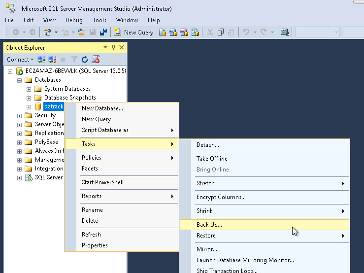
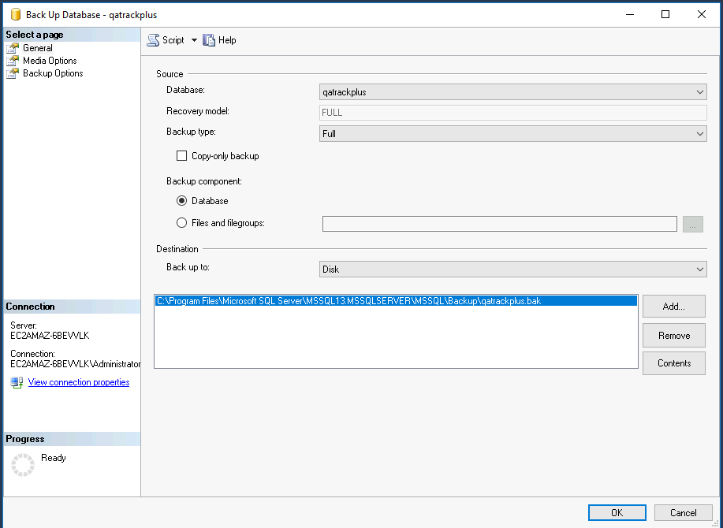

.. _`win_upgrading_40`:

Upgrading an existing Windows v3.1 installation to v4.0.0
=========================================================

This guide will walk you through upgrading your existing v3.1 installation to
v4.0.0. We understand that if you are not the original installer, this may be a bit daunting. Please reach out to the QATrack+ team for assistance if you have any questions or concerns.

Documented support for upgrading from previous versions of QATrack+ (v0.3.0 and earlier) to v4.0.0 is not available at this time. We would be happy to assist you with upgrading from these older versions, do not hesitate to reach out to the QATrack+ team for assistance, the :mailinglist:`Google Group<>` and :supportemail:`support email<>` are open to all users.

.. contents::
   :local:
   :depth: 2

Introductory Notes
------------------

There are significant changes to the tooling and dependencies in v4.0.0, please read through this entire guide before attempting to upgrade.  If you have any questions or concerns, please reach out to the QATrack+ team for assistance. Some of these changes include:

* The Python virtual environment is now managed by the ``uv`` package manager, which will handle a lot of the python heavy lifting for you.
* The old ``venvs/qatrack31`` directory is no longer needed.
* Manual installations of Python and pip are no longer required.
* We are going away from including specific versions in file names for the CherryPy service and scheduled task.  The new service is called *'QATrack+ CherryPy Service'* and the scheduled task is called *'QATrack+ Django Q Cluster'*.  This will make it easier to apply future patches.
* The Django engine for the database has changed from ``sql_server.pyodbc`` to ``mssql``.
* **Multiple languages are now supported,** please refer to the default local_settings.py file for guidance on how to configure your installation for multiple languages.

Take a snapshot
---------------

If your QATrack+ server exists on a virtual machine, now would be a great time
to take a snapshot of your VM in case you need to restore it later!  Consult
with your IT department on how to do this.

Backing up your database
------------------------

It is important you back up your database before attempting to
upgrade.  In order to generate a backup open SQL Server Management Studio
(SSMS), right click on your database then select `Tasks -> Back Up..`

   Backup Menu Item

Select `Copy-only backup` and make sure the `Backup component` is set to
`Database`. Take note of where the backup is being stored and then click `OK`:

   Backup Dialog

Backing up your Media folder
----------------------------

It is also crucial to back up your uploaded media files before upgrading. Navigate to your QATrack+ installation directory (e.g., ``C:\deploy\qatrackplus\qatrack\media``) and create a copy or zip archive of the entire ``media`` folder. Save this backup in a safe location.

Backing up your local_settings.py
---------------------------------

Your configuration, including database credentials and site-specific settings, is stored in ``local_settings.py``. Navigate to ``C:\deploy\qatrackplus\qatrack\`` and create a backup copy of ``local_settings.py`` before proceeding with the upgrade.

Stopping Background Services
----------------------------

Before changing branches or creating a new environment, you must stop your background task runner to prevent tasks from executing during the upgrade. You must also stop and remove the old CherryPy service using your existing Python environment. Open a PowerShell window and run:

.. code-block:: powershell

   # Stop background task runner
   # Note: Replace "QATrack+ Django Q Cluster" if you used a different name for your scheduled task
   >>  Stop-ScheduledTask -TaskName "QATrack+ Django Q Cluster"
   # Stop and remove CherryPy service
   >>  cd C:\deploy
   >>  .\venvs\qatrack31\Scripts\Activate.ps1
   >>  cd qatrackplus
   >>  python QATrack31CherryPyService.py stop
   >>  python QATrack31CherryPyService.py remove

To verify that the service has been removed, please open the **Services** application and check that there are no entries with QATrack or CherryPy in the name. If the service is still present, then open a CMD window (not PowerShell) as *Administrator* and run the following command to remove it:

.. code-block:: console

   >>  sc delete "QATrack31CherryPyService"

Prerequisites
-------------

Managing python dependencies and virtual environments can be a bit tricky on Windows. We have transitioned to using the ``uv`` package manager to handle this for us. To install QATrack+ run the following command in a PowerShell terminal with **Administrator privileges**:

.. code-block:: powershell

   >>  powershell -ExecutionPolicy ByPass -c "irm https://astral.sh/uv/install.ps1 | iex"
   >>  uv --version # this should print the version of uv installed, e.g. 0.11.20

Before beginning the installation, ensure the following software is installed on your server:

* **Google Chrome**: `Required to generate or schedule PDF reports. <https://www.google.com/chrome/index.html>`_
* **Microsoft Visual C++ Redistributable**: `The ODBC Driver for SQL Server requires this. <https://learn.microsoft.com/en-us/cpp/windows/latest-supported-vc-redist?view=msvc-170#latest-supported-redistributable-version>`_
* **ODBC Driver 17 for SQL Server**: `Required for QATrack+ to communicate with the database. <https://learn.microsoft.com/en-us/sql/connect/odbc/download-odbc-driver-for-sql-server?view=sql-server-ver17>`_
* **SQL Server Management Studio (SSMS)**: `Required for setting up the database. <https://learn.microsoft.com/en-us/ssms/install/install>`_
* **Git for Windows**: `Required to check out the QATrack+ source code. <https://git-scm.com/install/windows>`_
* **IIS** requires the `URL Rewrite 2.1 <https://www.iis.net/downloads/microsoft/url-rewrite>`__ and `Application Request Routing 3.0 <https://www.iis.net/downloads/microsoft/application-request-routing>`__ modules.

For convenience, these installers may be kept in a folder on the server (e.g. C:\\deploy\\installers) for future reference and re-use.

Checking out version 4.0.0
--------------------------

First we must check out the code for version 4.0.0 in a PowerShell window:

.. code-block:: powershell

   >>  cd C:\deploy\qatrackplus
   >>  git fetch origin
   >>  git checkout releases/4.0

.. dropdown:: Side note: Alternate Tag

   If you prefer to use a tag instead of a branch, you can check out the `v4.0.0` tag instead. We are switching defaults away from tags to branches for ease of patch distribution. Future patches can be applied simply with a git pull command, whereas tags are immutable. To check out the tag, run the following commands in a PowerShell window:

   .. code-block:: powershell

      >>  cd C:\deploy\qatrackplus
      >>  git fetch origin
      >>  git checkout v4.0.0

Updating our Python environment
~~~~~~~~~~~~~~~~~~~~~~~~~~~~~~~

For version 4.0.0, QATrack+ now uses the ``uv`` package manager, which will handle a lot of the python heavy lifting for you. We will create a new virtual environment inside the ``qatrackplus`` directory. Your old ``venvs/qatrack31`` directory is no longer needed.

First, delete the old virtual environment, and uninstall all installed python instances. Then we will install ``uv`` from the executable and create a new virtual environment. We will use powershell to fetch the installer. If you'd like you can download the latest ``uv`` installer `directly <https://github.com/astral-sh/uv/releases>`_.

Open a PowerShell window with **Administrator privileges** and run the following commands:

.. code-block:: powershell

   >>  powershell -ExecutionPolicy ByPass -c "irm https://astral.sh/uv/install.ps1 | iex"

Now with a normal PowerShell window, run the following commands to create a new virtual environment and install the required dependencies:

.. code-block:: powershell
   >>  cd C:\deploy\qatrackplus
   >>  uv venv --python 3.12
   >>  uv sync --extra win --extra mssql

Next, activate your new virtual environment:

.. code-block:: powershell

   >>  .\.venv\Scripts\Activate.ps1

Your command prompt should now be prefixed with ``(qatrackplus)`` or ``(.venv)``.

Updating your local_settings.py
~~~~~~~~~~~~~~~~~~~~~~~~~~~~~~~

There have been quite a few changes to the ``local_settings.py`` file. Depending on when your settings file was first configured it might deviate quite significantly. You will need to update your existing ``local_settings.py`` file to match the new format. Please refer to the `local_settings.py` files in the ``deploy/`` directories for guidance.

Major changes include:

* The Django engine for the database has changed from ``sql_server.pyodbc`` to ``mssql``.
* ``Allowed Hosts`` is now mandatory  for Django 4.2+ and must be set to a list of host names that your QATrack+ server will respond to. Because we are using IIS as a reverse proxy this only has to include the hostname and any CNAMEs or aliases.
* ``CSRF_TRUSTED_ORIGINS`` is now mandatory and must be populates similarly to ``ALLOWED_HOSTS``.

Updating the database
~~~~~~~~~~~~~~~~~~~~~

We can now upgrade the database schema and static media files to be compatible with the new version of QATrack+.

.. code-block:: powershell

   >>  python manage.py migrate
   >>  python manage.py createcachetable
   >>  python manage.py collectstatic

If you have issues with the migration, first check

.. dropdown:: Side note: Migrations

   Django migrations are a way of propagating database schema changes (e.g., adding a field to a model) into the database. Running migrations at the appropriate time is a crucial step in upgrading QATrack+ to ensure that the database schema is compatible with the new version of the application.

   Further information on Django migrations can be found in the `Django documentation <https://docs.djangoproject.com/en/4.2/topics/migrations/>`_.

.. dropdown:: Side Note: Testing the upgrade

   We now have a database, we have configured QATrack+ to use it, and we've loaded the default configuration data. Next, we could test that everything is working correctly by running the development server with `python manage.py runserver` and navigating to http://localhost:8000/ in a browser on the server. You should see a poor approximation of the QATrack+ login page (it won't look like this once we're finished!). If you see any errors, check the terminal output for details on what went wrong.  If you can log in successfully, then we know our database is configured correctly and we can move on to the next step.

.. include:: win.rst
   :start-after: .. _cherry_py_service:
   :end-before: .. _finally:
